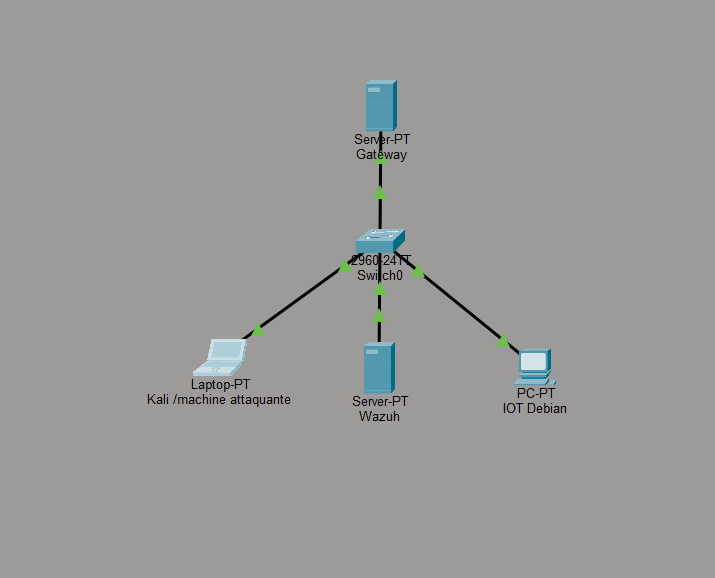

# 🛡️ SENTINEL-GATE : Architecture IPS & SIEM pour la Sécurité IoT

## 📖 Présentation du Projet
Ce projet consiste en la création d'une infrastructure de sécurité réseau multicouche. L'objectif est de sécuriser un segment de réseau IoT vulnérable en utilisant une Gateway intelligente capable d'inspecter, de filtrer et de bloquer les menaces en temps réel.

Le système repose sur la synergie entre un **IPS (Suricata)** et un **SIEM (Wazuh)** pour offrir une visibilité totale sur les tentatives d'intrusion et une réponse automatisée.

## 🏗️ Architecture Réseau


### 💻 Détails des Machines (VMs) :
- **Gateway (Debian 12) :** `192.168.1.1` | Moteur Suricata + Agent Wazuh.
- **ITProjet (Debian 12) :** `192.168.1.10` | Cible IoT (Broker MQTT).
- **Wazuh Manager (Ubuntu) :** `192.168.1.100` | Console de supervision SOC.
- **Attaquant (Kali Linux) :** Simulation de menaces externes.

---

## 🛠️ Stack Technique
- **IPS :** [Suricata 7.0](https://suricata.io/) (Mode Inline via NFQUEUE)
- **SIEM :** [Wazuh](https://wazuh.com/) (Centralisation des logs `eve.json`)
- **IoT :** Protocole MQTT (Simulateur Python `paho-mqtt`)
- **Virtualisation :** Oracle VM VirtualBox (Drivers `virtio-net`)

---

## 🛡️ Scénarios de Sécurité Implémentés
Le système est configuré pour détecter et bloquer activement :
1. **Reconnaissance :** Blocage des scans furtifs Nmap (Xmas, SYN).
2. **Brute-Force SSH :** Seuil de tolérance fixé à 5 tentatives avant bannissement.
3. **Déni de Service (DoS) :** Détection de flood MQTT via inspection profonde des paquets (DPI).

---

## 📂 Organisation du Dépôt
- `📂 architecture/` : Schémas réseau et fichiers Cisco Packet Tracer.
- `📂 configs/` : Fichiers de règles Suricata (`local.rules`) et configuration Wazuh.
- `📂 scripts/` : Script d'attaque sans machine Kali (`utiliser dans un environnement local`).
- `📂 vms/` : Guide de configuration des machines virtuelles.

---

## 🧪 Guide de Test (Sans Kali Linux)
Si vous ne disposez pas d'une machine d'attaque dédiée, vous pouvez valider la sécurité depuis n'importe quelle machine du réseau via notre script de test :

1. **Pré-requis :** Installer Python 3 sur votre machine de test.
2. **Lancer le test de sécurité :**
   ```bash
   chmod +x scripts/test_security.sh
   ./scripts/test_security.sh 192.168.1.10

## ⚙️ Installation Rapide (Gateway)

1. Activer le routage IP
```
sysctl -w net.ipv4.ip_forward=1
```
2. Configurer la file d'attente NFQUEUE
```
sudo iptables -I FORWARD -j NFQUEUE --queue-num 0
```
3. Démarrer Suricata en mode IPS
```
sudo suricata -c /etc/suricata/suricata.yaml -q 0
```

## 👥 Auteurs
- Léo Montois - L3 Informatique - UPHF
- Mathis Bruniaux - L3 Informatique - UPHF

## 📝 Note
Ce projet a été réalisé dans un cadre académique. Toutes les attaques ont été menées dans un environnement de laboratoire isolé.
